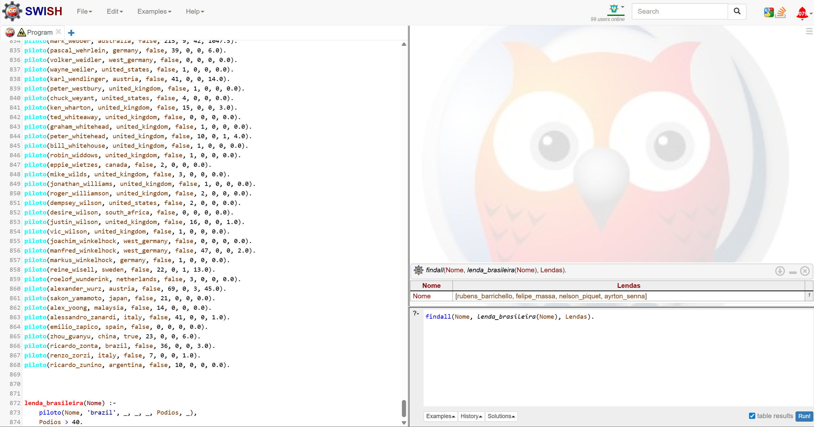
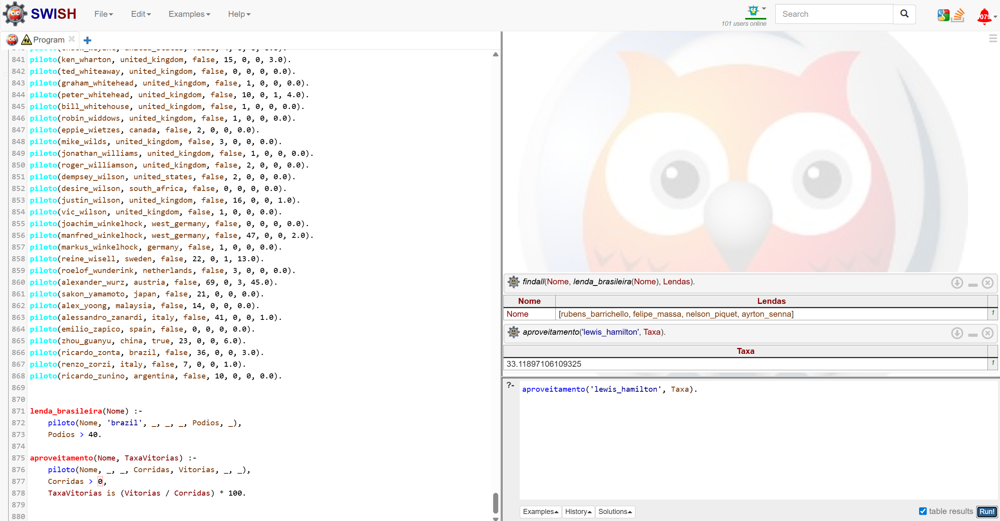
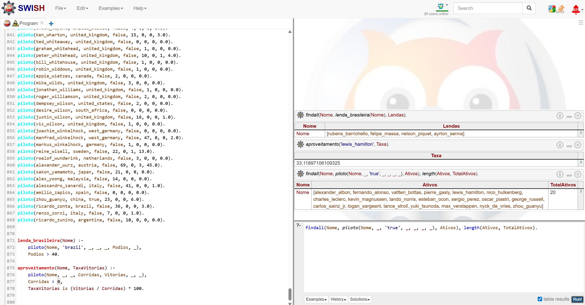

# 🏎️ F1 Knowledge Engine: Base de Conhecimento em Prolog

<div align="center">
  
  
  
</div>

---

## 📖 Sobre o Projeto
Este projeto foi desenvolvido como trabalho prático da disciplina de Matemática Discreta. O objetivo principal foi criar uma base de conhecimento estruturada em **Prolog** a partir de um dataset do Kaggle (["F1 World Championship 1950-2022"](https://www.kaggle.com/)), e então realizar consultas (queries) utilizando lógica para extrair informações relevantes e curiosidades sobre os pilotos de Fórmula 1.

O fluxo do projeto foi dividido em três etapas principais:
1. **Compreensão & Planejamento:** Estudo dos conceitos de lógica em Prolog, uso do ambiente SWISH, e compreensão da estrutura de um dataset real.
2. **ETL (Extract, Transform, Load):** Desenvolvimento de um script em Python (`F1/f1.py`) para limpar, formatar e converter os dados brutos em uma base de fatos unificada.
3. **Análise de Dados:** Elaboração de queries lógicas para obter respostas diretas e precisas a perguntas específicas de negócio a partir da base gerada.

---

## 🛠️ Estrutura da Base de Dados

O script em Python seleciona, higieniza (removendo acentos e espaços) e exporta 7 atributos principais de cada piloto para formar a base de conhecimento. Os fatos gerados seguem este formato padronizado:
```prolog
piloto(nome, nacionalidade, ativo, corridas_disputadas, vitorias, podios, pontos).
```

**Dicionário de Dados:**
- `Driver`: Nome do piloto (ex: `ayrton_senna`).
- `Nationality`: Nacionalidade (ex: `brazilian`).
- `Active`: Status de atividade do piloto até 2022 (`true`/`false`).
- `Race_Starts`: Quantidade total de corridas iniciadas.
- `Race_Wins`: Total de vitórias na carreira.
- `Podiums`: Total de pódios conquistados na carreira.
- `Points`: Total absoluto de pontos marcados.

---

## ❓ Perguntas e Resultados das Análises

Com a base de dados devidamente importada no ambiente de testes lógicos, três perguntas de negócio foram elaboradas e testadas. Você pode ver os resultados completos abaixo.

### 1. Lendas Brasileiras 🇧🇷
> **Pergunta:** Quais são os nomes de todas as "lendas brasileiras" (pilotos do Brasil com mais de 40 pódios) agrupados em uma única lista?

<details>
<summary><b>Ver Execução e Resposta (Clique para expandir)</b></summary>
<br>
A query desenvolvida varre a base de dados buscando todos os fatos que correspondam aos filtros de `nacionalidade = brazilian` e `podios > 40`, e depois concatena tudo.
<br><br>

</details>

### 2. Aproveitamento de Lewis Hamilton 🇬🇧
> **Pergunta:** Qual é a taxa de aproveitamento (porcentagem de vitórias em relação ao número total de corridas disputadas) de Lewis Hamilton?

<details>
<summary><b>Ver Execução e Resposta (Clique para expandir)</b></summary>
<br>
A query foca no piloto `lewis_hamilton`, resgata os valores de vitórias e corridas disputadas, efetuando o cálculo aritmético (regra de 3) para devolver a taxa de sucesso.
<br><br>

</details>

### 3. Grid Atual de Pilotos 🚥
> **Pergunta:** Qual é o número total exato de pilotos na base de dados que estão com o status ativo?

<details>
<summary><b>Ver Execução e Resposta (Clique para expandir)</b></summary>
<br>
Esta é uma consulta de agregação, em que é feita uma listagem completa de pilotos em que o parâmetro de "ativo" na F1 é igual a `true`, e em seguida o Prolog retorna o comprimento desta lista.
<br><br>

</details>

---

## 🚀 Como Executar o Projeto

### Pré-requisitos e Instalação

1. **Python 3.x** instalado na máquina.
2. (Opcional, mas recomendado) Ative o seu ambiente virtual (`venv`):
   ```bash
   # No Windows
   .\venv\Scripts\activate
   ```
3. Instale a dependência externa principal do projeto, que é o **Pandas**. As bibliotecas `re` e `unicodedata` já são ferramentas nativas da instalação padrão do Python.
   ```bash
   pip install pandas
   ```
4. Navegador web para acessar o ambiente lógico ([SWISH Prolog](https://swish.swi-prolog.org/)).

### Passo a Passo

1. **Gerar a Base de Conhecimento:**
   No diretório raiz do projeto, execute o script ETL em Python. Ele irá varrer o dataset e converter tudo para Prolog.
   ```bash
   python F1/f1.py
   ```
   *Um novo arquivo chamado `base_conhecimento_f1.pl` será gerado (ou atualizado) dentro da pasta `F1/`.*

2. **Realizar as Consultas (Queries):**
   - Acesse o site do [SWISH Prolog](https://swish.swi-prolog.org/).
   - Crie um novo "Program" e cole todo o conteúdo do arquivo `.pl` gerado no lado esquerdo da tela.
   - Use a janela interativa no canto inferior direito para digitar suas consultas e analisar a base de dados F1!

---
<p align="center">
  <b>Desenvolvido com dedicação para o curso de Matemática Discreta. 🏁</b>
</p>